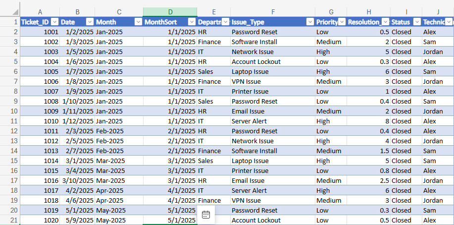
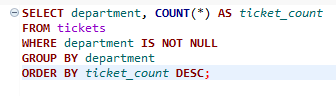
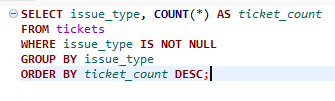
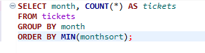
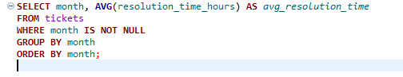
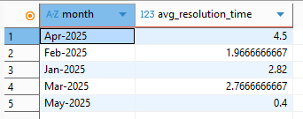
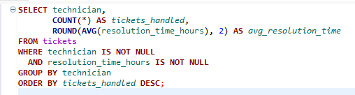
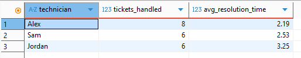

# Helpdesk SQL Analysis Project

This project demonstrates how to transform raw helpdesk ticket data into a structured SQLite database and perform analysis using SQL queries.

The workflow includes:

1. Exporting helpdesk ticket data to CSV
2. Loading the dataset into SQLite using Python and pandas
3. Writing SQL queries to analyze ticket trends
4. Visualizing ticket metrics using Excel pivot tables

This project simulates real-world IT support reporting and analytics tasks.

## Skills Demonstrated

- SQL querying and aggregation
- SQLite database creation and management
- Python data ingestion with pandas
- Data analysis and reporting
- Helpdesk ticket analytics
- GitHub project documentation

## Dataset
The dataset contains IT help desk ticket records including:
- Department
- Issue Type
- Priority
- Resolution Time
- Technician
- Ticket Date

## Technologies Used

- Python
- Pandas
- SQLite
- SQL
- DBeaver
- Excel
- GitHub


## Analysis Performed
- Ticket volume by department
- Ticket frequency by issue type
- Monthly ticket trends
- Average resolution time by priority
- Technician workload and performance

## Repository Structure
```
helpdesk-sql-analysis/
├── Create_db.py              # Builds SQLite database from CSV
├── helpdesk.db               # SQLite database
├── helpdesk_tickets.csv      # Source dataset
├── README.md
└── sql/
    └── analysis_queries.sql  # SQL analysis queries
```
## Example Queries

### Tickets by Department
```sql
SELECT department, COUNT(*) AS ticket_count
FROM tickets
GROUP BY department
ORDER BY ticket_count DESC;
```

### Tickets by Issue Type
```sql
SELECT issue_type, COUNT(*) AS ticket_count
FROM tickets
GROUP BY issue_type
ORDER BY ticket_count DESC;
```
## Project Screenshots

### Tickets Table (SQLite Database)


### Tickets by Department Query



### Tickets by Issue Type Query



### Tickets by Monthly Ticket Volume Query



### Tickets by Average Resolution Time by Priority



### Tickets by Technician Performance



